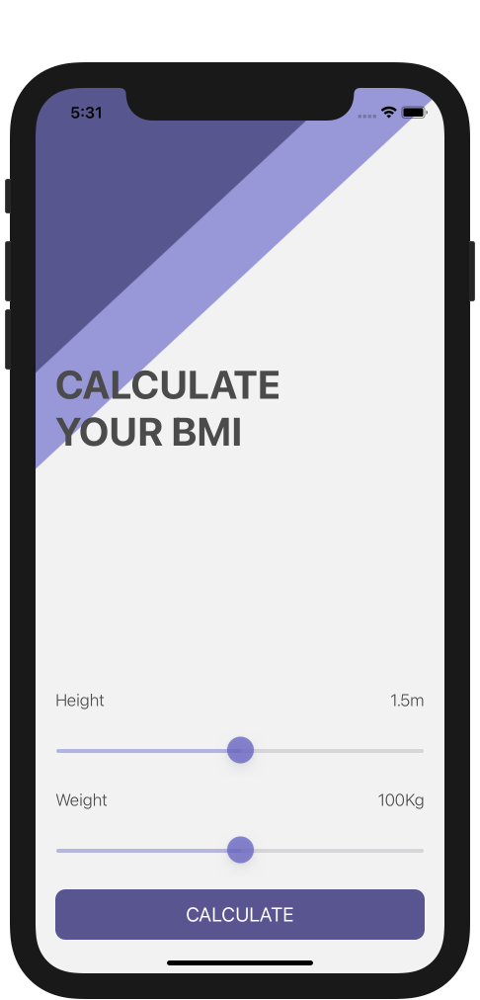
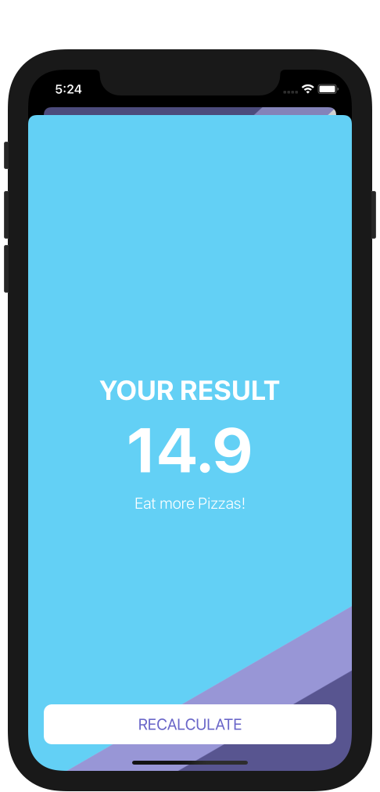
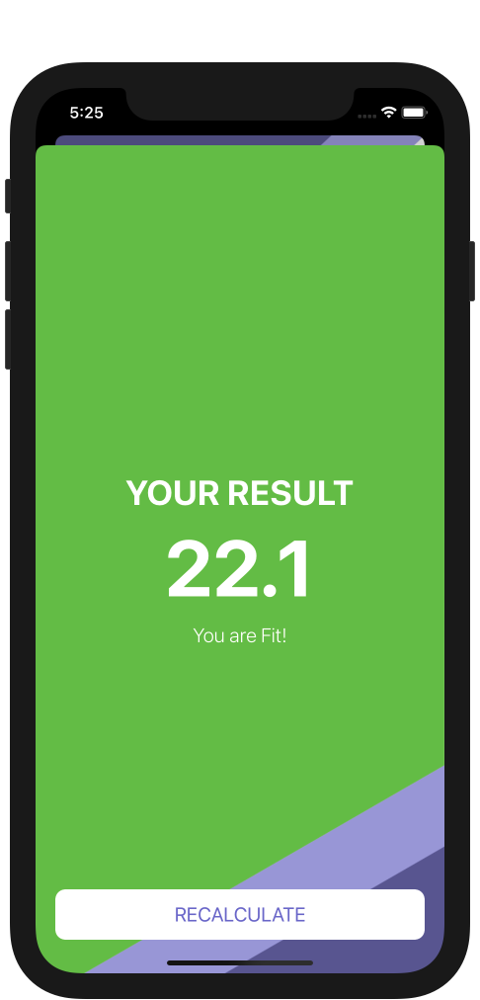
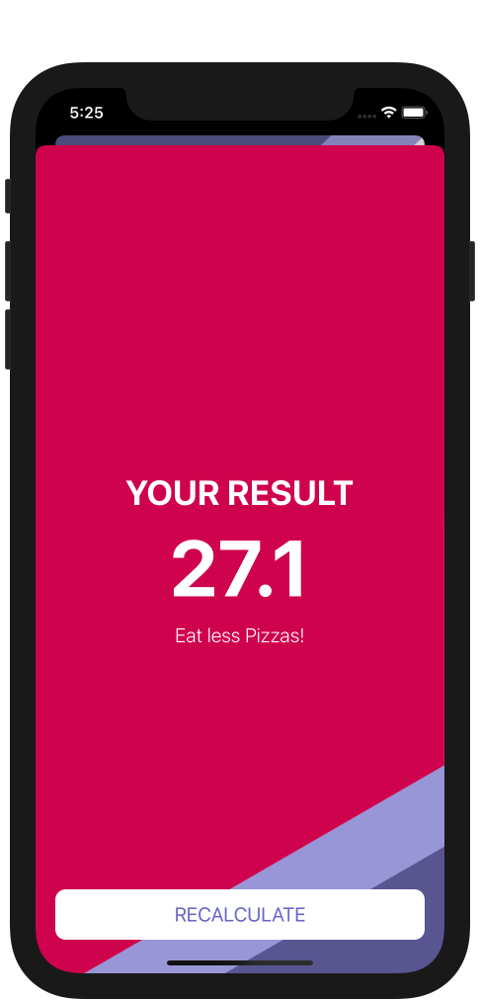
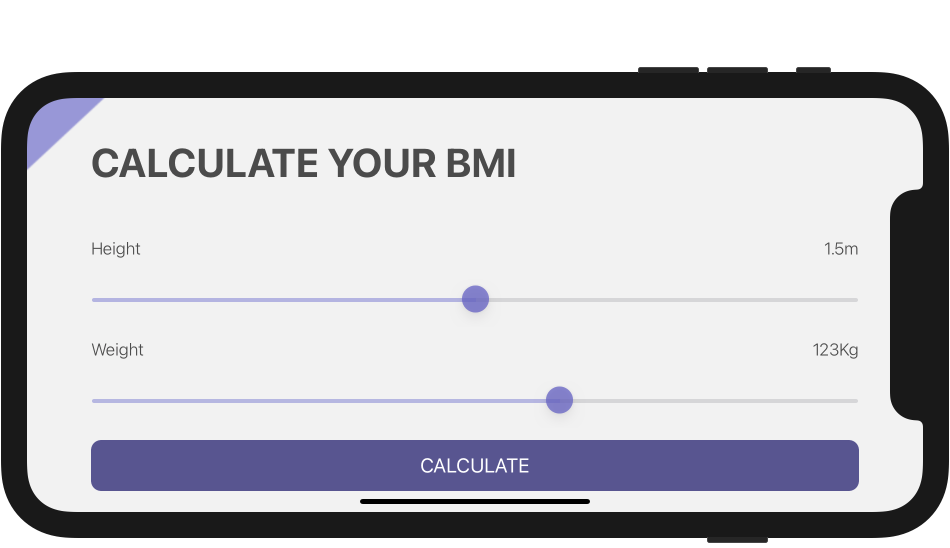
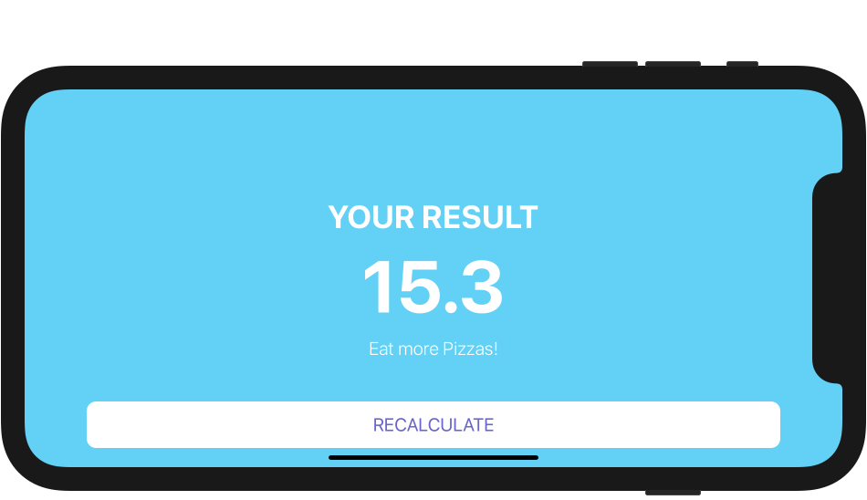
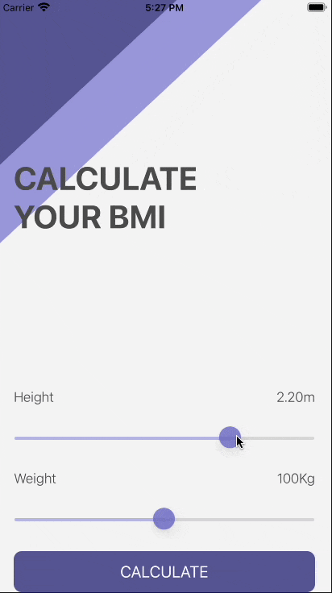

# BMI-Calculator
### Screen Shots

---

### Table of Contents

- [Description](#description)
- [How To Use](#how-to-use)
- [Author Info](#author-info)

## Description

- A simple BMI Calculator 

---

### What I Learned:

- How to create multi-screen apps with animated navigation.
- Optional binding, optional chaining and the nil coalescing operator.
- How to create classes and difference between classes and structs.
- Pass by value vs. pass by reference.
- Formatting Strings.
- Color literals.

---

## How To Use

- Clone the project and run it on Xcode
---

## Author Info
- Website - [LinkedIn: Gurpreet Singh](https://www.linkedin.com/in/gurpreet-singh-a2651b107/)

[Back To The Top](#BMI-Calculator)
